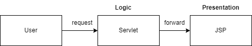

[](https://classroom.github.com/open-in-codespaces?assignment_repo_id=11725394)
# Web Lab - JSP
This lab demonstrate how to develop basic web application using JSP. The project use Jetty as an embeded web server where the JSP will be built and deployed on. This web application simply have an HTML form that submit a parameter to servlet to process and show the result on JSP.




## Exercise 1 - BMI Calculator
This program helps to calculate bmi by given weight and height. The program should also determine if the built is normal, underweight, overweight, etc., based on given figure in calculate.jsp in webapp/bmi
1. complete the `index.html` with two textfields for weight and height. 
2. the form's action should be properly pointed to the servlet to calculate BMI. 
3. complete BMICalculatorServlet, BMI should be integer number without any decimal points (You can use `Math.round()` function).
4. The servlet should determine the built type based on the given BMI as following:
    - BMI < 18.5 : underweight
    - 18.5 <= BMI < 25 : normal
    - 25 <= BMI < 30 : overweight
    - 30 <= BMI < 35 : obese
    - BMI >= 35 : extremely obese
5. add bmi and built type to the request attributes.
3. compelte `bmi_result.jsp` to show bmi and built type from the request attributes.


## Exercise 2 - Create Integration Testing for JSP
The integration test is in `TestBMICalculatorIT.java`. Please add another test case for normal built such as weight=50 and height=1.5.
You may study `testCaclulate1` as a sample. This test case should make a connection to JSP and comapre the given result with extected result. Consider the following:
- To sucessfully test the JSP. the JSP must be deployed on jetty.
- jetty server must be started before integration testing starts (please look at `pom.xml` line:107-170)

What benefit do we have from having integration tests in our project?
```
Your though here
The <executions> section defines two actions for the Jetty plugin: one to start Jetty before integration tests (pre-integration-test phase) and another to stop Jetty after integration tests (post-integration-test phase). This configuration lets you run unit tests (excluding those ending with "IT") and integration tests (using the Failsafe plugin) while managing an embedded Jetty server. It's a standard setup for web applications needing integration tests in a servlet container.```


